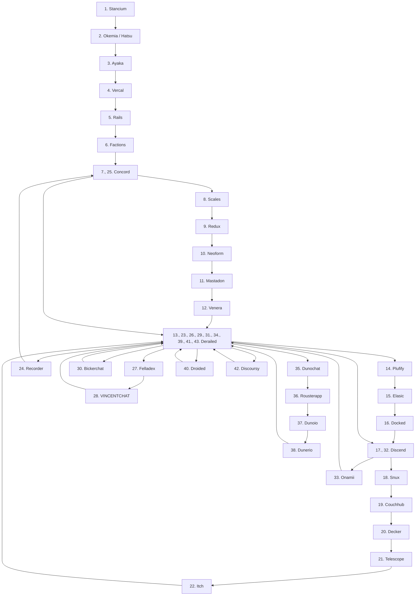

## Moved over to [vincent-everything-org-name-history](https://github.com/H4ckerxx44/vincent-everything-org-name-history)

The rather turbulent name history of a chat app made by vincent.

| No.| Name         | Date with link                                                                                              | Days lasted        |
|:--:|:-------------|:------------------------------------------------------------------------------------------------------------|-------------------:|
|  1 | Stancium     | [2021-12-08](https://github.com/decker-archive/api/commit/d37cab03ecc9ce0c4343052464a8006837c2bbe6)         | 71                 |
|  2 | Okemia/Hatsu | [2022-02-17](https://github.com/decker-archive/api/commit/bf0549264018319595e10b393a5762334cc4f31a)         | 23                 |
|  3 | Ayaka        | [2022-03-12](https://github.com/concordchat/api-docs/commit/ea8034a983003808c6df91c6c49cc21e8f72d858)       | 1                  |
|  4 | Vercal       | [2022-03-13](https://github.com/decker-archive/api/commit/050074b9ac3da41eb4852877b1ab46a0915c8817)         | 4                  |
|  5 | Rails        | [2022-03-17](https://github.com/decker-archive/api/commit/08f8ecb45e20014627295e1bb54c1a2644301d2c)         | 4                  |
|  6 | Factions     | [2022-03-21](https://github.com/concordchat/concord-api/commit/e539f7191fe8d70f9f8a77fb9a1b973541617a46)    | 32                 |
|  7 | Concord      | [2022-04-13](https://canary.discord.com/channels/881118111967883295/881118112492191796/963795519711367168)  | 17                 |
|  8 | Scales       | [2022-04-30](https://canary.discord.com/channels/881118111967883295/881118112492191796/969865722991869982)  | 3                  |
|  9 | Redux        | [2022-05-03](https://canary.discord.com/channels/881118111967883295/969836504128036864/970955845695324190)  | 16                 |
| 10 | Neoform      | [2022-05-19](https://github.com/concordchat/concord-api/commit/6c8003a077145dd9ae383b9b513fd685e6c2f066)    | 4                  |
| 11 | Mastadon     | [2022-05-23](https://canary.discord.com/channels/881118111967883295/881118112492191796/978299567256797234)  | 2                  |
| 12 | Venera       | [2022-05-25](https://canary.discord.com/channels/962194292296802334/962194292296802337/979015020316868669)  | 41                 |
| 13 | Derailed     | [2022-07-05](https://github.com/decker-archive/backend/commit/7b6c9420a0267762e040e9a541f29a5747f96dcd)     | 4                  |
| 14 | Plufify      | [2022-07-09](https://github.com/decker-archive/backend/commit/b174d2af013095bce4d06961e25f3e268b013b6f)     | 28                 |
| 15 | Elasic       | [2022-08-06](https://github.com/deckerapp/decker-gateway/commit/c751b61b7da63877e231d15109d1358ddde11193)   | 1                  |
| 16 | Docked       | [2022-08-07](https://canary.discord.com/channels/881118111967883295/881118112492191796/1005799500956323861) | 2                  |
| 17 | Discend      | [2022-08-09](https://canary.discord.com/channels/962194292296802334/988243874201862144/1006538875981799484) | 2                  |
| 18 | Snux         | [2022-08-11](https://canary.discord.com/channels/962194292296802334/988243874201862144/1007175454622490705) | 2                  |
| 19 | Couchhub     | [2022-08-13](https://github.com/deckerapp/decker-api/commit/ec2e9e191c3f599d1c4fbd8e8736be458967c487)       | 1                  |
| 20 | Decker       | [2022-08-14](https://canary.discord.com/channels/881118111967883295/881118112492191796/1008358169594048532) | 3                  |
| 21 | Telescope    | [2022-08-17](https://prnt.sc/vKodrdgCix6M)                                                                  | 0                  |
| 22 | Itch         | [2022-08-17](https://prnt.sc/FXkEyTVPULlS)                                                                  | 1                  |
| 23 | Derailed     | [2022-08-18](https://prnt.sc/kBW_ttEEzPnh)                                                                  | 5                  |
| 24 | Recorder     | [2022-08-23](https://prnt.sc/z8jW8QhW5lcL)                                                                  | 2                  |
| 25 | Concord      | [2022-08-25](https://prnt.sc/WZSED6E4a934)                                                                  | 3                  |
| 26 | Derailed     | [2022-08-28](https://prnt.sc/4Z6n3HfAwvUH)                                                                  | 3                  |
| 27 | Felladex     | [2022-08-31](https://prnt.sc/Wv5QwdNWspzZ)                                                                  | 1                  |
| 28 | VINCENTCHAT  | [2022-09-01](https://prnt.sc/NDmSsU1PWa4W)                                                                  | 2                  |
| 29 | Derailed     | [2022-09-03](https://prnt.sc/7Lyr7dgc6zbn)                                                                  | 2                  |
| 30 | Bickerchat   | [2022-09-05](https://prnt.sc/XBgDmvX8T8-a)                                                                  | 0                  |
| 31 | Derailed     | [2022-09-05](https://prnt.sc/XVDv59_w4jKU)                                                                  | 4                  |
| 32 | Discend      | [2022-09-09](https://prnt.sc/6lIYAbxxSDVA)                                                                  | 0                  |
| 33 | Onamii       | [2022-09-09](https://prnt.sc/uq1wrYfPlPGW)                                                                  | 0                  |
| 34 | Derailed     | [2022-09-09](https://prnt.sc/ToTSTSPMKZkF)                                                                  | 2                  |
| 35 | Dunochat     | [2022-09-11](https://prnt.sc/ik8NJ2g_PEt1)                                                                  | 0                  |
| 36 | Rousterapp   | [2022-09-11](https://prnt.sc/kNx-9Q7TH7U8)                                                                  | 0                  |
| 37 | Dunoio       | [2022-09-11](https://prnt.sc/MwqicqyDApo7)                                                                  | 0                  |
| 38 | Dunerio      | [2022-09-11](https://prnt.sc/m-f5x7_VAd_4)                                                                  | 1                  |
| 39 | Derailed     | [2022-09-12](https://prnt.sc/-_Jk_i1zQVm4)                                                                  | 0                  |
| 40 | Droided      | [2022-09-12](https://prnt.sc/TRxRfCQ703yA)                                                                  | 1                  |
| 41 | Derailed     | [2022-09-13](https://prnt.sc/IuAJ5YERqv2D)                                                                  | 79                 |
| 42 | Discoursy    | [2022-12-01](https://prnt.sc/ECAG_vXAaTWk)                                                                  | 16                 |
| 43 | Derailed     | [2022-12-17](https://prnt.sc/Szu0qAShTQaH)                                                                  | 339 (discontinued) |

